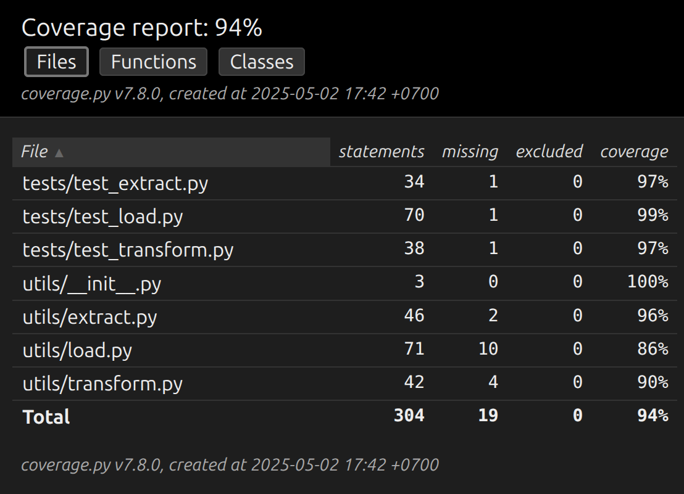

# ETL Pipeline: Fashion Studio Data Scraper

Proyek ini adalah implementasi pipeline ETL (Extract, Transform, Load) untuk melakukan web scraping data produk fashion dari situs [https://fashion-studio.dicoding.dev](https://fashion-studio.dicoding.dev). Pipeline dibuat secara modular menggunakan Python dan dilengkapi dengan unit testing serta laporan coverage.

## Struktur Folder

```
submission-fundamental-data/
├── utils/
│   ├── __init__.py
│   ├── extract.py
│   ├── transform.py
│   └── load.py
├── tests/
│   ├── __init__.py
│   └── test_extract.py
├── img/
│   └── coverage_test_result.png
├── main.py
├── requirements.txt
├── submission.txt
├── google-sheets-api.json
├── products.csv
└── README.md
```

## Penjelasan ETL

### Extract

Data diambil dari halaman utama dan halaman `page1` hingga `page50` dari situs Fashion Studio. Data yang dikumpulkan meliputi:

* Title
* Price
* Image URL
* Rating
* Colors
* Size
* Gender
* Timestamp

### Transform

* Membersihkan format harga dari simbol non-angka.
* Memecah warna menjadi list.
* Menstandarkan nilai size dan gender.

### Load

* Menyimpan hasil data ke dalam file CSV dan postgresql.
* Mendukung penyimpanan ke Google Sheets.

## Hasil Coverage

Berikut adalah hasil screenshot dari coverage test:



## Runing Code

```bash
# 1. Membuat virtual environment
python3 -m venv .venv

# 2. Mengaktifkan virtual environment
source .venv/bin/activate  # Linux/macOS
.venv\Scripts\activate    # Windows

# 3. Menginstal dependencies
pip install -r requirements.txt

# 4. Menjalankan skrip utama
python3 main.py

# 5. Menjalankan unit test pada folder tests
python3 -m pytest tests

# 6. Menjalankan test coverage pada folder tests
coverage run -m pytest tests

# 7. Melihat hasil coverage dalam format laporan
coverage report

# 8. (Opsional) Menyimpan hasil coverage sebagai file HTML
coverage html
```

## Url Google Sheets:

[https://docs.google.com/spreadsheets/d/1pvsfeNJHMKS-xevuULc2wOAhUICzBNt6hRGG7BlMdZE/edit?gid=0#gid=0](https://docs.google.com/spreadsheets/d/1pvsfeNJHMKS-xevuULc2wOAhUICzBNt6hRGG7BlMdZE/edit?gid=0#gid=0)
